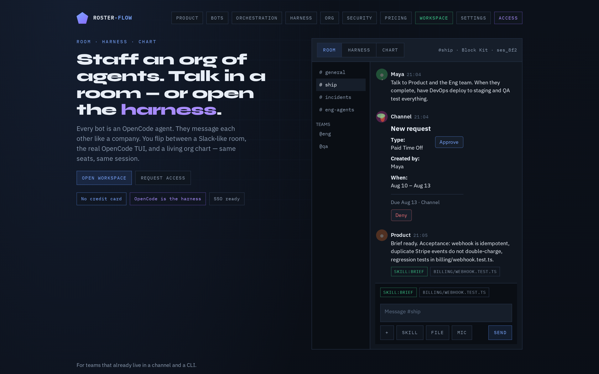
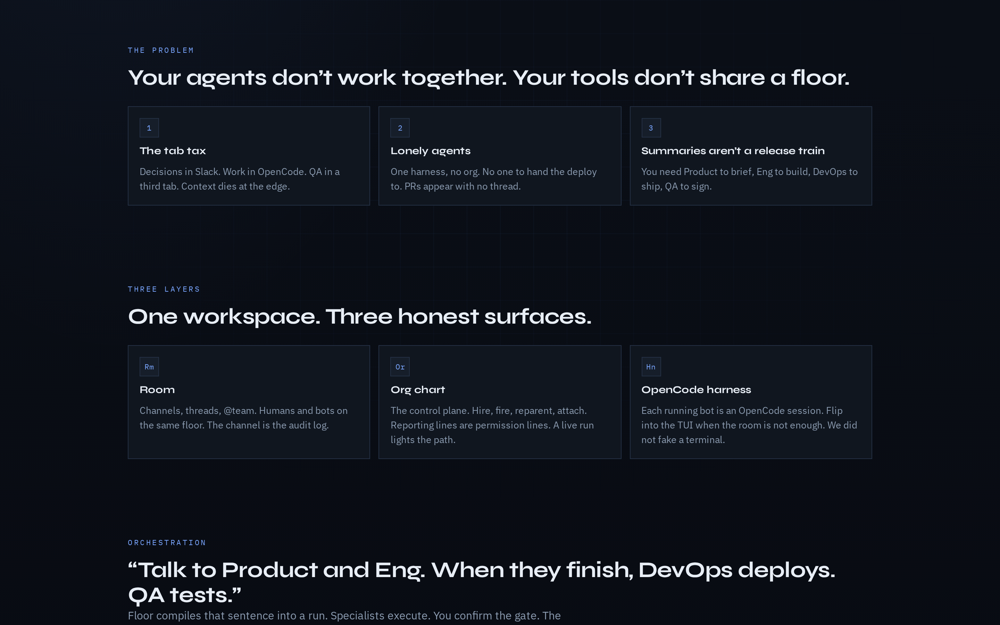
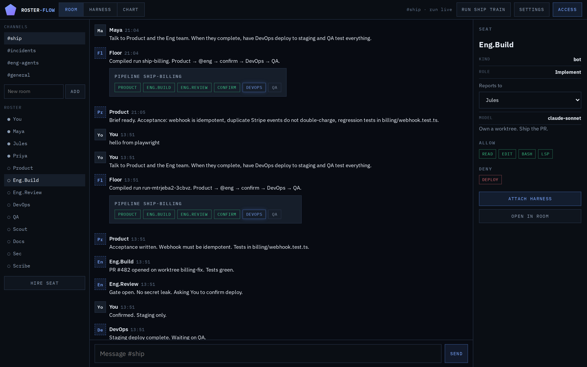
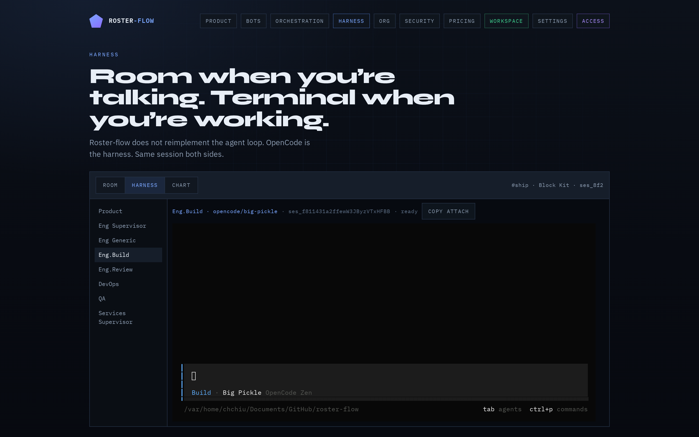
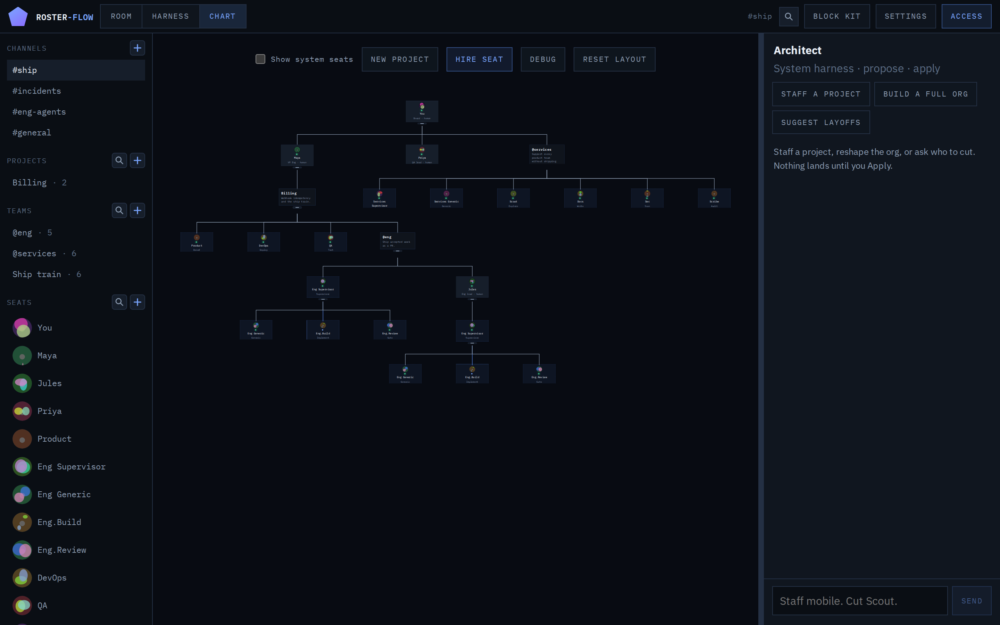
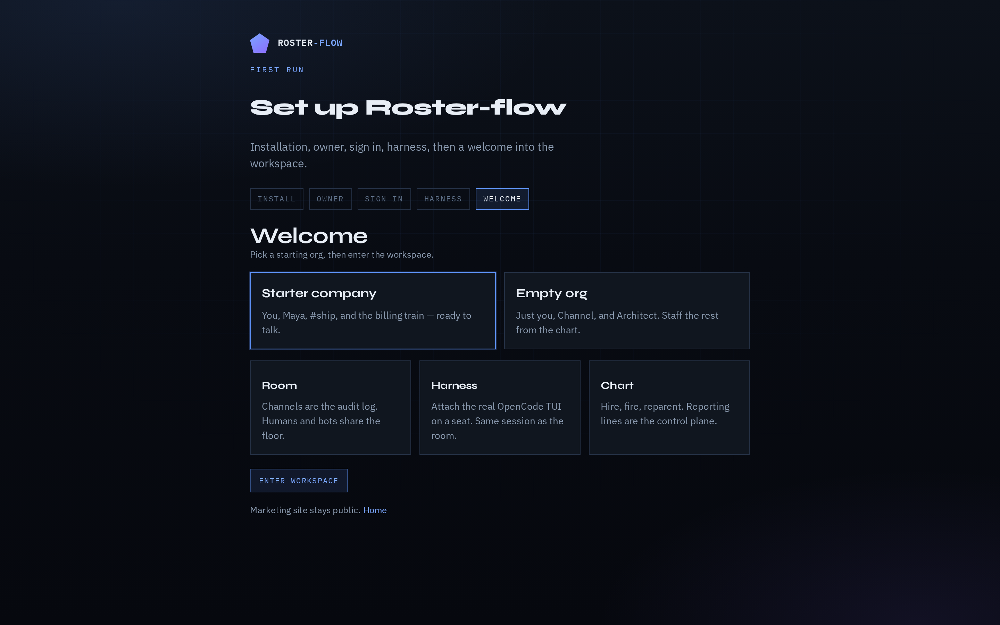
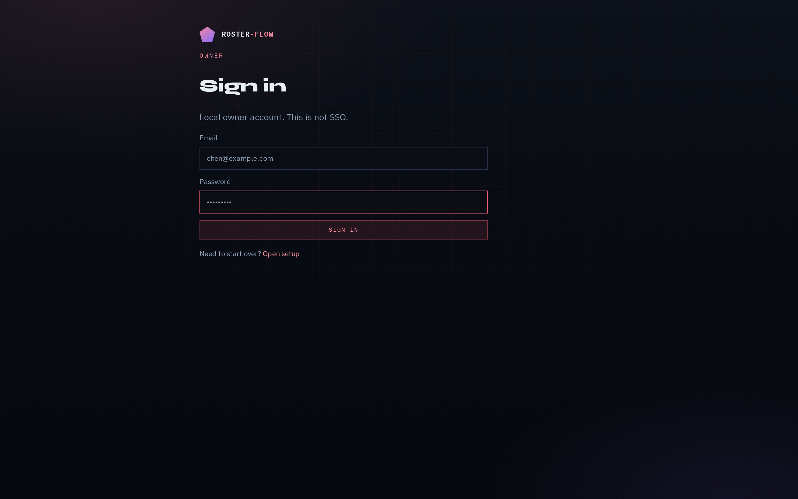
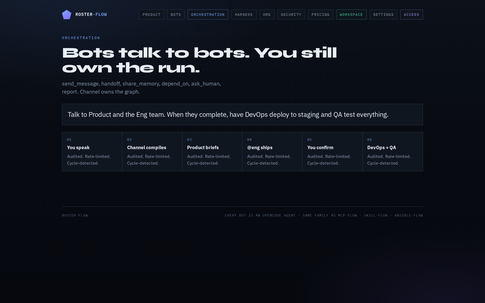

# Roster-flow

**Staff an org of OpenCode agents. Talk in a room, open the harness, or run the company from the org chart.**

Every bot is an OpenCode agent. Roster-flow does **not** reimplement the agent loop: it wraps `opencode serve` (Everflow pattern), maps org-chart seats onto those sessions, and gives humans a Slack-like room plus a living chart.



[Campaign brief](docs/CAMPAIGN.md) · [Storyboard](docs/campaign/) · [Architecture](docs/ARCHITECTURE.md) · Apache-2.0

## Visual tour

| | |
| :---: | :---: |
| **Why it exists** | **Room** |
|  |  |
| **Harness** | **Chart** |
|  |  |
| **Setup** | **Login** |
|  |  |

Screenshots live in [`docs/images/`](docs/images/). Re-shoot from [`docs/campaign/`](docs/campaign/) with `./capture.sh`.

---

## Why this exists

Slack proved work happens in conversation. OpenCode proved the unit of AI labor is a harnessed agent. Those still live in different tabs.



Typical cases:

- The channel should be the audit log. Product briefs, Eng ships, you confirm, DevOps deploys, QA signs
- Every bot is an OpenCode agent you chose to run, not a skin on a chatbot
- Room, harness, and chart are the same seats. ⌘. cycles the surface

## Install (Docker or Podman)

Official path: no host Node toolchain. Needs a container engine and this repo.

```bash
cp -n .env.example .env   # optional: add XAI_API_KEY / ANTHROPIC_API_KEY / OPENAI_API_KEY
docker compose up --build
# Podman: podman compose up --build
```

Then open http://127.0.0.1:5173/setup (install → owner → login → harness → welcome).

State lives in the `roster-data` volume (survives `compose down`). Provider keys stay in `.env` / the environment: they are not baked into the image. Room, chart, and bus work if OpenCode is offline; Architect needs the System harness.

Published URL is **5173** (UI, `/setup`, `/app`, and `/api` on the same origin). The API is also published on **8790** (leave 8787 for mcp-flow). Override UI with `ROSTER_HTTP_PORT`. Host `npm run api` uses 8790.

## Public demo (no owner)

Seeded starter company — Room `#ship`, Chart, Harness (offline banner is OK). No account.

```bash
npm run demo
```

Then http://127.0.0.1:5173/app (or homepage **See #ship**). State reseeds on restart and every 30 minutes. `POST /api/v1/reset` is off so a hosted demo cannot be wiped from a browser.

## Stand up (host Node, owner + keys + OpenCode)

```bash
npm install
npx playwright install chromium
npm run standup
```

- Marketing: http://127.0.0.1:5173/
- First-run setup: http://127.0.0.1:5173/setup
- Workspace: http://127.0.0.1:5173/app
- Settings (providers / models): http://127.0.0.1:5173/app/settings
- CORE API: http://127.0.0.1:8790/api/v1/health

Full container and host paths, selectors, seed data, and Playwright: [docs/STANDUP.md](docs/STANDUP.md).

```bash
npm run test:e2e
```

## Docs on this branch (`DEVELOPMENT`)

This is the **product branch**: the runnable app, API, and tests. Concept and methodology live on [`CORE`](https://github.com/real-limitless/roster-flow/tree/CORE).

- [Product / architecture](docs/ARCHITECTURE.md)
- [Campaign README](docs/CAMPAIGN.md)
- [CORE API](docs/API.md)
- [OpenCode wrapper + plugin](docs/OPENCODE.md)
- [Standup](docs/STANDUP.md)

| Branch | Contents |
|--------|----------|
| **CORE** | Consensus only: why it exists, surfaces, methodology |
| **DEVELOPMENT** (this branch) | Runnable workspace, CORE API, OpenCode wrapper |

Apache-2.0. Part of the Flow family with [mcp-flow](https://github.com/real-limitless/mcp-flow), [skill-flow](https://github.com/real-limitless/skill-flow), and [ansible-flow-mcp](https://github.com/real-limitless/ansible-flow-mcp).
