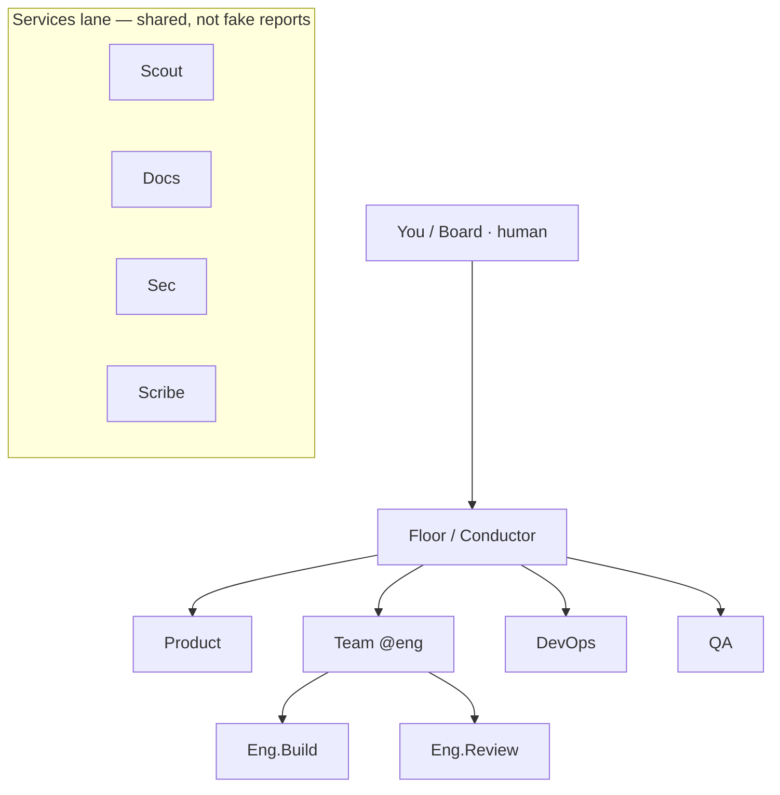
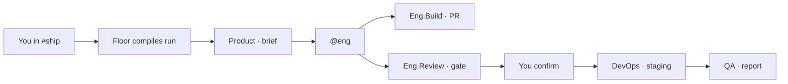

# Roster-flow — Website Implementation Plan

**Prepared for:** Lovable.dev, Cursor, v0, and similar AI-powered vibe-coding builders  
**Document Version:** 1.4  
**Date:** September 6, 2026  
**Use Case:** New marketing site + product narrative for **Roster-flow** — a workspace that combines Slack-style team chat, an organization of OpenCode-harnessed bots that talk to each other, a living org chart as the control plane, and a triple surface: Room · Harness · Chart.

**Inspiration sources:** Slack.com (channels, huddles, room gravity), Cursor.com (agentic coding), Grok Bot (teammates with a computer), OpenCode / anomalyco/opencode (the harness every Roster-flow bot runs on), Paperclip (org chart of agents), OpenAgents Workspace, Dust, Linear Agents, Goose, oh-my-openagent, Agent Teams. See §12 for the full steal-list.

**Name:** **Roster-flow** (wordmark). Spoken: “Roster flow.” Former working name: Relay. Repo-style slug: `roster-flow`. One-word logo variant if needed: Rosterflow.


---

## How to Use This Document

1. **Start in Lovable (or Cursor / v0):** Create a new project.
2. **Copy the entire "Master Project Prompt" section below** and paste it as your first message. That locks vision, design system, and structure.
3. **Iterate intelligently:**
   - Reuse the **Design System** in every follow-up so colors, type, and radius stay consistent.
   - Build or refine **one section or page at a time** from the Detailed Specs.
   - Use the **Example Iteration Prompts** when something feels generic.
4. **Build in phases** (see Roadmap). Do not ask the model for the entire site in one shot.
5. After structure and visual polish are solid, connect waitlist/auth, then deploy.

This document is modular on purpose. Copy subsections into the builder chat as needed.

---

## Master Project Prompt (Copy & Paste Ready)

```
You are an expert product designer and frontend engineer who builds premium, high-converting SaaS marketing sites for developer tools and AI workspaces.

Project: Build a complete, production-ready marketing website for Roster-flow.

Roster-flow is a team workspace with three layers:
1. A Slack-like Room — channels, threads, @mentions, huddles.
2. An organization of bots that orchestrate like a real company. Each bot is not a chatbot. Each bot is an OpenCode Agent running the OpenCode harness (sst/opencode): its own session, tools, permissions, memory, and computer.
3. A triple interface the user flips at any time:
   - Room mode = Slack-like conversation.
   - Harness mode = drop into that bot’s live OpenCode TUI/CLI (the real harness — sessions, tools, bash, diffs, Tab to switch agents).
   - Chart mode = living org chart. Structure (who reports to whom) + Work overlay (what is running now). Click a seat → Room thread or Harness attach.

One-line pitch: Staff an org of OpenCode agents. Talk in a room, open the harness, or run the company from the org chart.

What makes Roster-flow different:
- Bots talk to each other. They send messages, share memory, hand off jobs, and wait on dependencies — like an org chart that ships.
- The user can say: “Talk to Product and the Eng team. When they complete, have DevOps deploy to staging and QA test everything.” Roster-flow turns that into a run: Conductor routes work, specialist bots execute, DevOps deploys, QA reports back in the same thread.
- Users create Organizations → Projects → Teams of bots. Each team is a named roster with a conductor and specialists.
- Every bot the user decides to run is an OpenCode Agent: custom system prompt, model, mode (primary | subagent), tool permissions (bash, read, edit, grep, webfetch, task, …), skills, and memory blocks.
- Advanced users flip a control and are inside the OpenCode CLI harness for that bot — not a fake terminal skin, the actual session.
- The org chart is the control plane: hire, fire, reparent, attach. Reporting lines are permission lines. A live run lights the path on the same tree.
- P0 product mechanics the site must show: seat inspector, hire-from-chart, ask_human walks reports_to, constitution.md on the project, worktree per Eng.Build.

Target audience (primary): Engineering leads and founding teams at 8–200 person software companies who already live in Slack + an agent CLI (OpenCode, Claude Code, Cursor) and want the org chart of agents visible in a room — plus the ability to drop into the harness when the room is not enough.

Secondary audience: Product, ops, QA, and DevOps leads who want to @mention a team of bots and get a deploy + test report back, without running the TUI themselves.

Overall vibe and aesthetic:
Dark-first, cinematic, precise. Cursor’s midnight studio + Slack’s human room + the honest grain of a real terminal. Three visual languages that share one chrome: Room (message bubbles, channels, Bot cards), Harness (OpenCode-style TUI), Chart (living org tree, dashed bot seats, amber run path). Amber filament #E8A317 means “live agent / action.” After three seconds: “This is Slack if every teammate was an OpenCode agent you can also open in the terminal — and run from an org chart.”

Strict Design System (apply consistently everywhere):
- Color palette:
  - Canvas / page background: #0B0D10
  - Elevated surface / cards: #14171C
  - Soft panel: #1B1F27
  - Hairline / borders: #2A303A
  - Text primary: #F4F1EA
  - Text muted: #9AA3B2
  - Primary accent (CTAs, live agent, harness cursor): #E8A317
  - Accent hover / glow: #F3BE4A
  - Secondary accent (online / Bot working / tests green): #3DDC97
  - Danger / mention / failed job: #FF4D6D
  - Link / info / tool-trace: #7EB6FF
- Typography: Geist or Inter for UI and body. Geist Mono or IBM Plex Mono for harness/TUI mockups and code. Optional display: Instrument Serif italic for 1–2 hero words. Headings 700. Body 400–500, line-height 1.6. H1 ~56–72px desktop / 36px mobile. Body 16–18px. TUI text 12.5–13.5px mono.
- Spacing & layout: Max content width 1200–1280px. Section padding py-20 to py-28 desktop, py-12 mobile. Cards rounded-2xl (16px). Buttons rounded-full or rounded-xl. Soft inner glow on accent buttons, never cheap neon.
- Icons & imagery: Lucide line icons, 1.5px stroke. Product imagery = high-fidelity dark UI mockups. Must show THREE surfaces: (A) Slack-like room with a team of named bots and a run card; (B) Harness — a real-looking OpenCode TUI attached to one bot; (C) Chart — starter org tree with a live amber path Product → Eng → DevOps → QA. Avoid generic stock photos and purple AI orbs.
- Motion: Subtle. Hero mockup ambient glow. Room | Harness | Chart toggle on the hero mockup. Section fade-up ~300ms. Button hover: translateY(-1px) + amber glow. Respect prefers-reduced-motion.

Site structure & pages:
1. Home
2. Product (Room, Org chart, Orchestration, Triple mode)
3. Bots (each bot is an OpenCode Agent — roster, how they’re built)
4. Orchestration (bots talking to bots, example ship pipeline)
5. Harness (Room mode vs OpenCode CLI / TUI)
6. Org chart (living structure + work overlay — the control plane)
7. Organizations (orgs, projects, teams of bots)
8. Use cases
9. Security
10. Pricing
11. Changelog
12. Contact / Get access

Key requirements:
- Mobile-first, fully responsive.
- Conversion focus: primary CTA “Request access”. Secondary “See Room, Harness, and Chart”.
- Forms: Access request — Name, Work email, Company, Role, Team size, “What do you want Roster-flow to replace first?” (Slack + plugins / OpenCode-only / Cursor chat / ChatGPT / other). Success state + “we’ll reply within 1 business day.”
- Trust: placeholder logos, 3 specific testimonials, 4 stats.
- SEO: one H1 per page.
- Accessibility: WCAG AA. Amber buttons use #0B0D10 label text. Visible focus rings. Semantic HTML.

Start by building the HOMEPAGE only, in this exact section order:
- Navbar (Roster-flow | Product, Bots, Orchestration, Harness, Org, Security, Pricing | Sign in | Request access)
- Hero (headline, sub, dual CTAs, mockup with Room | Harness | Chart segmented toggle)
- Logo / social-proof strip
- Problem (tab tax + lonely agents)
- Product pillars (Room · Org chart · OpenCode harness)
- Orchestration story (one concrete pipeline: Product + Eng → DevOps deploy → QA)
- Triple-mode section (flip Room | Harness | Chart)
- Starter roster (cleverly built bots)
- How a bot is built (OpenCode agent anatomy)
- Org chart teaser (starter company + live path)
- Orgs / Projects / Teams
- Testimonials + stats
- Security strip
- Final CTA
- Footer

Stop after the homepage is visually polished. Show me the result before other pages.

Make it feel premium and shipped. Never generic AI-startup lavender.
```

---

## 1. Project Overview & Goals

### Business & Context Summary

Roster-flow is the room where a human org and a bot org share one floor. Slack proved work happens in conversation. OpenCode proved the right unit of AI labor is not a chat bubble — it is a **harnessed agent**: session, tools, permissions, memory, a loop that can use bash and edit files until the job is done. Grok Bot proved a teammate can have its own computer. Roster-flow puts those on one org chart.

A Roster-flow bot is an **OpenCode Agent**. When a user chooses to run a bot, Roster-flow starts (or attaches to) an OpenCode session for that agent — the same harness a developer already trusts in the terminal. The Room is how the rest of the company talks to that session. Harness mode is how a power user *enters* it.

Bots are not isolated. They message each other, share scoped memory, hand off work, and block on each other like a real team. A user can say, in a channel:

> Talk to **Product** and the **Eng** team. When they complete, have **DevOps** deploy to staging and **QA** test everything.

That sentence becomes a run: Conductor routes, specialists work in parallel or in sequence, DevOps ships, QA reports. The thread is the audit log.

### Primary Business Goals for the Website

- Convert eng leads who already use OpenCode / Cursor / Slack into access requests.
- Make the dual surface obvious in one scroll: Room *and* the real harness.
- Make orchestration concrete (one pipeline, not abstract “multi-agent”).
- Position bots as **crafted OpenCode agents**, not skins on a chatbot.
- Establish trust: permissions, confirm-on-deploy, no training on workspace data.

### Target Audience Personas

**Primary Persona**  
Name / Role: Maya, VP Engineering at a 40-person B2B SaaS company  
Pains: Slack is where decisions happen; OpenCode is where work happens; they do not share a room. Agents open PRs nobody in `#ship` asked for. QA finds out after deploy.  
Goals: One sentence in a channel should run Product → Eng → DevOps → QA. Ability to drop into any bot’s OpenCode session when something is weird.  
How they use the site: Hero toggle Room/Harness, read the pipeline, request access.

**Secondary Persona**  
Name / Role: Jules, founding engineer who already lives in the OpenCode TUI  
Pains: The harness is perfect for *one* agent. Orchestrating five agents plus humans is glue scripts and hope.  
Goals: Keep the real TUI. Gain an org, a bus, and a Slack-like floor for everyone else.  
How they use the site: Harness page → Bots anatomy → Access.

**Third Persona**  
Name / Role: Priya, Head of QA / DevOps  
Pains: “It works on my agent.” No ticket, no environment, no report in the channel.  
Goals: Be a first-class bot on the team. Get a deploy notification and a test report without joining a terminal session.  
How they use the site: Orchestration story → Security → Access.

### Success Metrics (Suggested)

- Access-request conversion on Home, Orchestration, Harness
- Interaction with the Room | Harness toggle (proves the dual surface landed)
- Scroll depth past the pipeline story
- Security page time-on-page
- Form quality (work email + team size + replacement intent)
- Lighthouse > 90, WCAG AA

---

## 2. Brand Identity & Design System

### Overall Vibe / Aesthetic

Dark studio, warm paper type, one amber filament. Three dialects of the same product:

- **Room dialect:** channels, avatars, Bot cards, run timelines. Human. Slack muscle memory.
- **Harness dialect:** monospaced traces, session IDs, tool calls (`bash`, `edit`, `task`), a status bar that looks like OpenCode — because it *is* OpenCode attached to that bot.
- **Chart dialect:** dark canvas org tree. Human seats solid, bot seats dashed amber, team rings, live run path. The chart is a control plane, not wallpaper.

Personality is dry and specific. We say “agent,” “harness,” “run,” “handoff,” “permission,” not “magic teammates.”

### Color Palette

| Role | Hex | Usage notes | Emotional meaning |
|---|---|---|---|
| Canvas | `#0B0D10` | Page background | Night studio |
| Surface | `#14171C` | Cards, nav, mockup chrome | Depth |
| Panel | `#1B1F27` | Rails, TUI chrome | Hierarchy |
| Hairline | `#2A303A` | Borders | Quiet structure |
| Text primary | `#F4F1EA` | Headings, body | Warm paper |
| Text muted | `#9AA3B2` | Captions, TUI dim | Secondary |
| Accent / CTA | `#E8A317` | Buttons, live agent, TUI cursor | Intent |
| Accent hover | `#F3BE4A` | Hover glow | Energy |
| Success / live | `#3DDC97` | Online, tests passing, deploy ok | Alive |
| Danger | `#FF4D6D` | @mention, failed job, denied tool | Urgency |
| Info / traces | `#7EB6FF` | Links, tool names in TUI | Clarity |
| Button label on accent | `#0B0D10` | Text on amber | Contrast |

**Dark Mode:** Default. Light theme is Phase 5, not launch.

### Typography

- **UI / body:** Geist or Inter.
- **Harness / TUI / code:** Geist Mono or IBM Plex Mono, 12.5–13.5px in mockups.
- **Display (hero only):** Instrument Serif italic on one word.
- **Scale:** H1 56–72 / 36 mobile · H2 32–40 / 28 · Body 16–18 · Caption 13–14.
- **Tracking:** −0.02em on H1.

### Spacing, Elevation & Component Primitives

- Max width 1200px content; 1440px full-bleed mockups.
- Section padding 80–112px desktop, 48px mobile.
- Radius: 16px cards, 999px pills, 8px TUI inner chrome (tighter — terminals are sharp).
- Shadows: hairlines + amber/black radial glow behind hero.
- **Segmented control** (Room | Harness): pill track `#1B1F27`, active amber text on dark, 1px hairline.
- Buttons: primary solid amber + dark label. Secondary hairline.

### Imagery, Illustration & Icon Style

Must-have mockup frames:

1. **Room** — left: org switcher + channels + **Teams** (`Eng`, `QA`, `DevOps`) + bot DMs. Center: thread with a **Run card** (“Pipeline `ship-billing` · Product ✓ · Eng ✓ · DevOps deploying · QA waiting”). Right: bot roster with status pips.
2. **Harness** — OpenCode-like TUI: session list for `eng.build`, live tool trace, diff hunk, bottom status `eng.build · anthropic/claude-sonnet · session ses_8f2 · 14 tools`.
3. **Org builder** — canvas of teams and bots with edges labeled `handoff` / `message` / `blocks-on`.
4. **Agent file** — markdown + YAML frontmatter preview (`mode: primary`, `permission:`, `model:`) so “cleverly built” is visible.

Icons: Lucide. No Slack-hash knockoff. No orb mascots.

### Motion & Micro-interactions

- Hero: Room | Harness toggle crossfades the mockup (200ms).
- Run card: status pills fill left-to-right as steps complete.
- Harness caret blinks.
- Bot working: green pip pulse.
- `prefers-reduced-motion: reduce` disables float and pulse.

---

## 3. Information Architecture & Navigation

### Primary Navigation Structure

**Desktop Navbar** (sticky, `#0B0D10/80` + blur):  
**Roster-flow** · Product · Bots · Orchestration · Harness · Org · Security · Pricing  
Right: Sign in · **Request access**

**Mobile:** Wordmark + sheet with all links + full-width CTA.

**Footer (4 columns):**
- Roster-flow — pitch, X / GitHub / Discord
- Product — Product, Bots, Orchestration, Harness, Organizations, Changelog
- Company — Security, Privacy, Terms, Contact
- Get access — email field
- © 2026 Roster-flow · “Every bot is an OpenCode agent.”

### Sitemap / Page Hierarchy

- `/` — Home
- `/product` — Room + Org + Dual mode overview
- `/bots` — Roster, anatomy of an OpenCode agent, how to craft one
- `/orchestration` — Bot-to-bot bus, runs, the ship pipeline
- `/harness` — Room mode vs OpenCode TUI/CLI, attach, `opencode` familiarity
- `/org` — Living org chart + work overlay (control plane)
- `/orgs` — Organizations, Projects, Teams of bots (create/staff flows)
- `/use-cases` — Incident, ship, GTM, ops
- `/security` — Permissions map to OpenCode tool perms + org policy
- `/pricing` — Seat + bot-hours + harness sessions
- `/changelog`
- `/contact`
- `/privacy` · `/terms`

**User flows**
1. Hero toggle → feel dual surface → Request access
2. Orchestration pipeline → “that’s my release train” → Access
3. Bots anatomy → OpenCode users feel at home → Access
4. Security → Pricing → Access

---

## 4. Product Model (read this before designing pages)

This section is the source of truth for copy and mockups. The website must not contradict it.

### 4.1 Hierarchy

```
Organization
 └── Project          (a repo, a product, a surface)
      └── Team        (named roster of bots + humans)
           ├── Conductor bot   (routes, does not ship code by default)
           ├── Specialist bots (each = one OpenCode Agent)
           └── Human members
```

A user belongs to one or more orgs. An org contains projects. A project contains teams. A team is the unit you @mention: `@eng`, `@qa`, `@gtm`.

### 4.2 A bot is an OpenCode Agent

When the user decides to **run** a bot, Roster-flow starts or resumes an OpenCode session bound to that bot.

| OpenCode concept | Roster-flow mapping |
|---|---|
| Primary agent / subagent | Bot kind. Conductors and specialists the user chats with are primary. Helpers they spawn are subagents. |
| Agent markdown + YAML frontmatter | The bot’s **spec** — prompt, mode, model, tools |
| `opencode agent create` | **New bot** wizard in Roster-flow (Room UI or Harness) |
| Session | One running instance of that bot (can fork, continue, attach) |
| Tools (`bash`, `read`, `edit`, `glob`, `grep`, `webfetch`, `task`, `todowrite`, `websearch`, `lsp`, `skill`) | Granted per bot. Plan-like bots cannot `edit`/`bash` write. DevOps gets deploy skills. QA gets test skills, not prod deploy. |
| Permissions / confirm | Destructive tools require human or policy confirm (merge, deploy prod, delete) |
| Skills + MCP | How a bot grows without becoming a god-bot |
| Memory blocks / journal | Per-bot memory + shared team memory + org memory |
| `task` tool (spawn subagent) | Internal to one bot. Cross-bot work uses the **bus**, not a nested soup |
| TUI / `opencode` CLI / `opencode attach` | **Harness mode** |
| `opencode serve` + HTTP/SSE | How Room talks to the harness without faking it |

**Rule:** Roster-flow does not reimplement the agent loop. OpenCode *is* the loop. Roster-flow is the org, the room, the bus, the chart, and the switch that opens the TUI.

### 4.3 Triple surface

| | Room mode | Harness mode | Chart mode |
|---|---|---|---|
| Feels like | Slack | OpenCode TUI / CLI | Living org chart |
| Who it’s for | Whole company | The person driving a bot | Leads staffing and steering the company |
| Unit | Channel, thread, run card | Session, tool trace, diff | Seat, reporting line, run path |
| How you talk | Message, @bot, @team | Prompt in the harness, Tab to switch agents | Click a seat, hire/fire/reparent, overlay a run |
| How you see work | Cards, status pills, files in-thread | Live tool calls, logs, worktree | Amber path on the tree + seat status pips |
| Flip | Segmented control or `⌘.` cycles Room → Harness → Chart. Click a seat to jump to its thread or attach its harness. |

Same bot. Same session. Three views. Messages posted in Room appear in the OpenCode session; tool results and handoffs post back as Room events and as path updates on the chart.

### 4.4 Bot-to-bot bus

Every running bot can, subject to policy:

- **`send_message`** — to a bot, a team, a channel, or a thread
- **`handoff`** — close my phase, open yours with a clean or summarized brief
- **`share_memory`** — write/read a named block (`team/eng/conventions`, `run/ship-billing/findings`)
- **`create_task` / `depend_on`** — task board the Conductor owns
- **`ask_human`** — park the run on a required approval
- **`report`** — structured result back to the originating thread

Bots do **not** silently prompt each other in an infinite loop. The Conductor (or the human) owns the run graph. Fan-out is explicit. Rate limits and a cycle detector sit on the bus.

### 4.5 The sentence that must work

User in `#ship`:

> Talk to **Product** and the **Eng** team. When they complete, have **DevOps** deploy to staging and **QA** test everything.

Roster-flow compiles this to a run:

```
run.ship-billing
  ├─ Product        (brief, acceptance, scope)     [OpenCode plan-like]
  ├─ Eng team       (build + review, parallel)     [OpenCode build agents]
  │    ├─ eng.api
  │    └─ eng.web
  ├─ gate           (human or policy: merge ok?)
  ├─ DevOps         (deploy staging)               [deploy skill, confirm]
  └─ QA             (smoke + critical paths)       [test skill, report]
```

The thread shows a live run card. Each node is a bot you can open in Harness mode. When QA finishes, the card is green or red and the report is in-thread.

### 4.6 Starter roster — cleverly built, not generic

These are the default bots a new project can enable. Each has a tight job, a tight tool belt, and a tight memory scope. Users clone and rewrite them.

| Bot | OpenCode posture | Tools (default) | Clever bit |
|---|---|---|---|
| **Floor / Conductor** | Primary, low write | `task` denied for code; bus tools; read-only repo | Compiles human sentences into run graphs. Never ships code. |
| **Product** | Plan-like primary | read, grep, webfetch, memory — **no edit, no bash write** | Turns channel talk into a brief + acceptance list other bots must satisfy. |
| **Eng.Build** | Build primary | read, edit, bash, grep, glob, lsp, todowrite | Owns a worktree. Implements against Product’s acceptance. |
| **Eng.Review** | Plan / review | read, grep, lsp — no edit | Adversarial pass. Can block the gate. |
| **DevOps** | Build + skills | bash (scoped), read, deploy skill, no prod without confirm | Environments as memory. Deploy is a skill, not “run whatever.” |
| **QA** | Build + test skill | bash (test cmds), read, webfetch | Writes/runs checks against Product acceptance. Cannot deploy. |
| **Scout** | Subagent / explore | read, grep, glob, webfetch | Cheap, fast, disposable context. Conductor spawns these. |
| **Docs** | Mid | read, edit (docs paths only) | Updates the file Product pointed at. Nothing else. |
| **Sec** | Review | read, grep — no edit | Dependency and secret scan. Can block merge. |
| **Scribe** | Primary, no tools that mutate | memory, send_message | Turns huddles and runs into the audit note. Always on. |

Cleverness rules for any new bot:

1. One job on the org chart. If you need two jobs, make two bots.
2. Deny by default. OpenCode frontmatter lists what is *allowed*; everything else is closed.
3. Memory is scoped (bot / team / project / org). No global soup.
4. A bot may message peers. It may not impersonate them.
5. A bot that can deploy cannot also be the only reviewer.
6. Every bot has an owner human and a kill switch.

---

## 5. Detailed Page & Section Specifications

### Homepage (`/`)

**Purpose:** Make Room + org-of-bots + real OpenCode harness obvious, then show one pipeline, then collect access.

#### Navbar
Sticky dark blur. After scroll, hairline border. Active link = 1px amber underline.

#### Hero
**Layout:** Copy left, mockup right. Mobile: copy, toggle, mockup.

**Headline:**  
`Staff an org of agents. Talk in a room — or open the harness.`  
(Optional serif italic on *harness*.)

**Subheadline:**  
Every bot is an OpenCode agent. They message each other like a company. You flip between a Slack-like room and the real OpenCode TUI on the same session.

**Primary CTA:** `Request access`  
**Secondary CTA:** `See Room and Harness` (scrolls to dual-mode section)

**Visual:** Mockup with a **Room | Harness** segmented control on the frame.
- Room state: `#ship` thread + run card `Product → Eng → DevOps → QA` + roster.
- Harness state: TUI attached to `eng.build`, tool trace mid-`edit`, session id visible.

**Micro under CTAs:** `No credit card` · `OpenCode is the harness` · `SSO ready`

#### Logo strip
“For teams that already live in a channel and a CLI.” Placeholder wordmarks.

#### Problem
**Headline:** Your agents don’t work together. Your tools don’t share a floor.

Three cards:
1. **The tab tax** — Decisions in Slack. Work in OpenCode. QA in a third tab.
2. **Lonely agents** — One harness, no org. No one to hand the deploy to.
3. **Summaries aren’t a release train** — You need Product to brief, Eng to build, DevOps to ship, QA to sign.

#### Product pillars
**Headline:** One workspace. Three honest layers.

| Room | Org of bots | OpenCode harness |
|---|---|---|
| Channels, threads, @team. Humans and bots on the same floor. | Organizations, projects, teams. Bots message, remember, and block on each other. | Each running bot *is* an OpenCode session. Flip into the TUI when the room is not enough. |

#### Orchestration story
**Headline:** “Talk to Product and Eng. When they finish, DevOps deploys. QA tests.”

Full-width run timeline (horizontal on desktop):

1. You speak in `#ship`
2. **Floor** compiles a run
3. **Product** writes acceptance (plan tools only)
4. **Eng.Build** + **Eng.Review** (parallel / gate)
5. **DevOps** deploys staging (confirm)
6. **QA** runs the suite, posts the report

Under the timeline: a thread screenshot of the same run as cards. Caption: *The channel is the audit log. Each node opens in Harness mode.*

#### Triple-mode section
**Headline:** Room. Harness. Chart.

Three frames in one chrome with a segmented control:
- Room — `#ship` thread + run card
- Harness — OpenCode TUI on `eng.build`
- Chart — living org tree with the active run path lit amber

Bullets:
- Same seats, same sessions, three views
- `⌘.` cycles Room → Harness → Chart
- Click a seat on the chart to open its thread or attach its harness
- `opencode attach` still works for people who live in a real terminal

#### Starter roster
**Headline:** Not one assistant. A company you staff.

Grid of the 10 starter bots (name, one-line job, tool belt as tiny chips: `read` `edit` `deploy×`). Link: “See how a bot is built →” `/bots`

#### How a bot is built (teaser)
Two-column: left, a bot spec file (YAML frontmatter + prompt excerpt). Right, bullets: mode, model, permissions, skills, memory scope, owner. CTA to `/bots`.

#### Org chart teaser
**Headline:** The org chart is the control plane.

Full-bleed dark canvas mock of the starter company (see §12). Human seats solid, bot seats dashed amber, Services lane under the tree. One live run path glowing Product → Eng → DevOps → QA. Caption: *Reporting lines are permission lines. A live run lights the path. Hire, fire, and attach from the chart — it is not wallpaper.* Link `/org`.

#### Orgs / Projects / Teams teaser
Simple diagram: Org → Projects → Teams → bots+humans. One sentence: “Add an org. Add a project. Staff a team. @mention the team.” Link `/orgs`.

#### Proof
Stats (placeholders): `1 harness per bot` · `N bots per team` · `thread = run log` · `confirm on deploy`

Testimonials:
- Eng lead: “I told the channel to talk to Eng and QA. I opened Harness on DevOps when the deploy hung. Same session.”
- Founder: “It feels like Slack until I hit ⌘. and I’m in OpenCode.”
- QA: “I’m a bot on the team. I don’t get a surprise dump. I get a run that waits for me.”

#### Security strip
SSO · Per-bot tool deny-by-default · Confirm on deploy/merge · No training on workspace · Audit of every bus message. Link `/security`.

#### Final CTA
**Headline:** Put the harness on the org chart.  
**Sub:** Invite-only while we scale agent computers.  
**CTA:** Request access

**Homepage SEO**  
Title: `Roster-flow — Slack-like rooms, OpenCode bots that work as a company`  
Meta: `Each Roster-flow bot is an OpenCode agent. They talk to each other. Flip between a Slack-like room and the real OpenCode harness.`

---

### Product Page (`/product`)

**Hero:** `The room, the org, the harness.`

Sections:
- Room — channels, threads, huddles, run cards
- Org chart — living structure + work overlay (link `/org`)
- Org — orgs / projects / teams (summary + link `/orgs`)
- Orchestration preview + link `/orchestration`
- Triple mode + link `/harness` and `/org`
- Integrations — GitHub, Linear, Vercel, plus anything an OpenCode skill/MCP can touch
- Final CTA

### Bots Page (`/bots`)

**Hero:** `Every bot is an OpenCode agent you chose to run.`

Sections:
- Definition: bot = OpenCode Agent + Roster-flow identity (name, team, memory scope, owner)
- Anatomy diagram: Spec file → Session → Tools → Memory → Bus
- How to craft one: wizard that mirrors `opencode agent create` (description, mode `all | primary | subagent`, permissions allow-list, model)
- Starter roster deep-dive (the table in §4.6, one card each)
- “Clever, not clever-clever”: the six rules
- Bring-your-own: import an existing `.opencode/agents/` file
- CTA

### Orchestration Page (`/orchestration`)

**Hero:** `Bots talk to bots. You still own the run.`

Sections:
- The sentence that works (interactive-looking quote + compiled graph)
- Bus verbs: message, handoff, memory, depend_on, ask_human, report
- Worked example: billing fix — Product brief → Eng PR → DevOps staging → QA report → human merge
- Failure paths: QA red, DevOps needs confirm, cycle detector stopped a loop
- Conductor vs specialists (Conductor does not write code)
- CTA

### Harness Page (`/harness`)

**Hero:** `Room when you’re talking. Terminal when you’re working.`

Sections:
- What Harness mode is: attached OpenCode TUI for that bot’s session
- Familiar commands mental model: `opencode`, `--session`, `attach`, Tab to switch agents, tool permission prompts
- Why we didn’t fake a terminal: the loop, tools, and permissions *are* OpenCode
- Headless path: Room drives `opencode serve` / SDK; you never have to open TUI
- Power path: local `opencode attach` to a Roster-flow-hosted session (or run the bot on your machine)
- Keyboard: `⌘.` flip, `⌘K` command palette (Jump to bot / Open harness / Stop run)
- CTA

### Organizations Page (`/orgs`)

**Hero:** `Add an org. Add a project. Staff a team of bots.`

Sections:
- Create org (name, owners, SSO later)
- Create project (repo connect, default memory, default roster)
- Create team (pick starter bots, name them, set Conductor)
- Invite humans
- @team from any channel in that project
- Move / clone bots between projects (spec copies; memory does not leak by default)
- CTA

### Org Chart Page (`/org`)

**Hero:** `The org chart is the control plane.`

**Sub:** Hire a bot like you hire a person. Drag a reporting line. Watch the work move. Click any seat to join its room or drop into its OpenCode harness.

**Sections:**
- Living canvas (Structure | Work | Hybrid)
- Seat inspector drawer (role, tools allow/deny, model, budget, last 5 runs, Open / Pause / Fire, Attach harness)
- Hire flow (template → name → team → tools → budget → session boots)
- Run overlay (compiled sentence lights the path)
- Services lane (Scout, Docs, Sec, Scribe — shared, not fake reports)
- Export as `multi-team.yaml` for OpenCode
- Templates: Startup squad (default), Platform squad, Agency (capped — never 167 god-bots)
- Final CTA: `Open the chart` / `Request access`

**Visual rules:**
- Human seats: solid stone cards
- Bot seats: dashed amber border + terminal glyph
- Team clusters: faint amber ring labeled `@eng`
- Active run: amber polyline with directional ticks
- Blocked-on-you: pulsing amber badge
- Memory scopes as concentric rings in the inspector, not on the canvas

### Use Cases (`/use-cases`)

Four stories, each ending in a run graph + Access:
- **Incident** — Scout + Eng.Build + DevOps + Scribe
- **Ship train** — the canonical Product → Eng → DevOps → QA
- **Docs + product** — Product + Docs, Eng only if the brief says so
- **Ops** — a small team of bots with no repo write, only connectors

### Security (`/security`)

Table:

| Control | Default |
|---|---|
| Training on workspace / session data | Off. Never. |
| Tool permissions | Deny by default; OpenCode frontmatter is source of truth |
| Deploy / merge / delete | Confirm (human or dual-control policy) |
| Bus | Authenticated, audited, rate-limited, cycle-detected |
| Memory | Scoped bot / team / project / org; no silent promotion |
| Tenant isolation | Per organization |
| SSO / SAML / SCIM | Team and Enterprise |
| Secrets | Not in prompts; skill-scoped; customer-held keys optional |
| Kill switch | Per bot, per team, per run |

FAQ: What OpenCode can see, where sessions live, DPA, SOC2 roadmap (honest).

### Pricing (`/pricing`)

| Starter | Team | Enterprise |
|---|---|---|
| 1 project, small roster | Orgs + teams + bus | SSO, VPC/session placement, custom skills |
| Shared bot-hours | Pool + harness attach | Dedicated hours + SLA |
| Room + Harness | + parallel runs | + policy engine, audit export |
| Request access | Request access | Talk to us |

Copy note: price **bot-hours** (OpenCode session time) separately from human seats.

### Changelog (`/changelog`)

Ship log voice. First entries can be: “Room | Harness flip”, “Bus: handoff + depend_on”, “Imported OpenCode agent specs”, “DevOps confirm-on-deploy”.

### Contact (`/contact`)

**Headline:** Tell us what Roster-flow should replace first.

Fields: Name, Work email, Company, Role, Team size, multi-select replace (Slack + AI plugins / living in OpenCode alone / Cursor chat / ChatGPT / other), “Will you run Harness mode daily?” (yes/no), optional note.

Success: “You’re on the list. We’ll reply within one business day — usually with a 20-minute walkthrough of Room and Harness on the same bot.”

---

## 6. Forms, CTAs & Conversion Optimization

- **Primary:** `Request access`
- **Secondary:** `See Room and Harness` · `Read the ship pipeline` · `See how a bot is built`
- Work email required. Privacy line: “We don’t train on your workspace. We won’t sell this list.”
- Thank-you view, not only a toast.

---

## 7. Technical, SEO, Performance & Accessibility

- LCP < 2.5s — hero mockups are optimized stills (WebP/AVIF), not a 2MB video. Toggle swaps two images.
- Schema: Organization + SoftwareApplication + FAQPage on Security.
- Analytics: `request_access_submit`, `hero_toggle_harness`, `pipeline_section_view`.
- A11y: amber buttons use dark text; TUI mockups are images with long alt text describing the session, not undreadable 11px live DOM.
- Prefer CSS glow over video.
- Deploy: Lovable or Cursor → Vercel, custom domain.

---

## 8. Content Tone, Voice & Messaging Guidelines

**Tone:** Staff-engineer dry. Specific nouns: harness, session, run, handoff, permission, worktree.

**Do:**
- Say “each bot is an OpenCode agent.”
- Show one pipeline instead of claiming “autonomous organization.”
- Keep Conductor from sounding like a god-model.

**Don’t:**
- “Multi-agent magic.”
- “Autonomous company that runs itself.”
- Fake-terminal screenshots that aren’t OpenCode-shaped.
- Impersonate Slack, xAI, or official OpenCode brand assets. Inspired-by is fine. Logos in the lockup are not.

**Key Messaging Pillars**
1. **Bot = OpenCode Agent** — we didn’t invent a weaker loop.
2. **They talk on a bus you can see** — message, handoff, memory, gate.
3. **Room or harness** — same session, two surfaces.
4. **Org → Project → Team** — staff it like a company.
5. **The channel is the audit log.**

---

## 9. Implementation Roadmap (Recommended Phasing)

**Phase 1 — Homepage**  
Master Prompt. Hero **Room | Harness | Chart** toggle must work visually. Pipeline and starter org chart must be readable. Lock design system.

**Phase 2 — Conversion spine**  
Contact form. Security (permissions story). Pricing.

**Phase 3 — Depth pages**  
Bots (anatomy + roster). Orchestration (bus + worked example). Harness. `/org` living chart. Orgs create/staff flows.

**Phase 4 — Polish & launch**  
Motion on the run card and chart path, OG image (Room + TUI + Chart split), metadata, analytics, domain.

**Phase 5 — Optional**  
Interactive product demo (scripted Room + TUI + chart), changelog CMS, real auth.

---

## 10. Example Iteration Prompts

- “Add a Room | Harness | Chart segmented control on the hero mockup. Room = #ship thread + four-step run card. Harness = OpenCode TUI for eng.build. Chart = living org tree with Product → Eng → DevOps → QA path lit amber. Same outer chrome.”
- “Rewrite the H1 so an OpenCode user and a Slack user both get it in one line. Keep the word harness.”
- “Build the starter roster as a 2×5 grid. Each card: bot name, six-word job, three permission chips. Conductor has no edit chip. DevOps has a deploy chip. QA has a test chip and no deploy chip.”
- “Add an orchestration section that typesets this user sentence as a quote: ‘Talk to Product and the Eng team. When they complete, have DevOps deploy to staging and QA test everything.’ Then show the compiled run graph under it.”
- “Create /harness next. Explain that Roster-flow does not reimplement the agent loop — OpenCode is the harness. Show attach / same session / ⌘. flip.”
- “Create /bots next. Show a markdown agent spec with YAML frontmatter (mode, model, permission allow-list) beside the Room avatar for that bot.”
- “On mobile, hero shows Room only by default with a control to switch to Harness. Run card stacks vertically.”

---

## 11. Assumptions Made & Open Questions for You

**Assumptions**
- Working name is **Roster-flow** (formerly Relay).
- This document is still the **marketing-site** implementation plan, now updated so the site tells the real product story (OpenCode harness, bot bus, dual mode, orgs/teams). It is not the backend build of that product — say the word if you want that architecture next.
- OpenCode (sst/opencode) is the runtime for every bot the user chooses to run. Models are whatever OpenCode is configured to use (Grok, Claude, GPT, local, …).
- Triple mode (Room | Harness | Chart) is a first-class product surface, not a hidden advanced flag.
- The org chart is a control plane (hire, fire, reparent, attach), not HR wallpaper.
- Paperclip-style 167-agent agencies are a warning, not a template. Roster-flow ships a small clever roster.
- Bots may talk to each other only through the audited bus; no silent infinite loops.
- We will not ship Slack / xAI / OpenCode trademarks in the logo.
- Invite-only conversion at launch.

**Open questions**
- Wordmark: **Roster-flow** vs **Rosterflow** (one word on the logo)?
- Should Harness mode be an embedded TUI in the browser, a popped terminal, or both (embed + `opencode attach`)?
- Default starter roster: keep the ten bots above, or start narrower (Conductor, Build, Review, DevOps, QA)?
- Who hosts the OpenCode process — Roster-flow cloud sandbox, the user’s machine, or either?
- Official partnership language with OpenCode / xAI, or stay “powered by OpenCode”?
- Access form destination (email, Linear, HubSpot)?
- Do you want a follow-on **app architecture** doc (Room client, bus, OpenCode session manager, org graph) after this site spec?

---

## 12. Org Chart — Starter Company (draw this)

Two views of the same object. Structure is who reports to whom. Work is what is running now.

### Structure



### Work overlay (the sentence compiled)



### Seat rules on this chart

| Seat | Kind | Reports to | May | Must not |
|---|---|---|---|---|
| You / Board | Human | — | Approve deploy/merge, fire any seat | — |
| Floor | Bot | You | Compile runs, message any seat | Edit code, deploy |
| Product | Bot | Floor | Read, brief, write acceptance | Edit, bash write |
| Eng.Build | Bot | @eng | Edit worktree, bash | Deploy prod |
| Eng.Review | Bot | @eng | Read, block gate | Edit |
| DevOps | Bot | Floor | Deploy skill | Skip confirm |
| QA | Bot | Floor | Test against acceptance | Deploy |
| Scout / Docs / Sec / Scribe | Bot | Services | Tight scopes | Become god-bots |

Click any seat → Room thread **or** Harness attach (same OpenCode session). Drag to reparent → permission inheritance + confirm toast.

---

## 13. What else to add (feature backlog folded into the product)

### P0 — ship on the site story now

- Third mode: **Room | Harness | Chart**
- Living org chart + work overlay on one canvas
- Seat inspector (tools, model, budget, last runs, kill switch, attach)
- Hire / pause / fire from the chart
- Escalation walks `reports_to` — `ask_human` never dumps to `#general`
- `constitution.md` + `AGENTS.md` pinned on the Project node
- Worktree per Eng.Build; Review is read-only on the same tree

### P1 — makes it feel like a company

- Agent System of Record (owner human, SLA, on-call, cost)
- Memory namespaces: seat / team / project / org
- Conflict protocol: Build vs Review opens a Decision room with the human manager
- Agent kanban: Idle / Assigned / Running / Blocked / Review / Done
- Skills packs: `SKILL.md` + MCP per role (ship 8 with the starter roster)
- Scheduled heartbeats: bots wake, pick work, report
- Replay theater: scrub a finished run on the chart
- Cost / token budget chip per seat and per team
- Org export as `multi-team.yaml` (git-versioned topology)

### P2 — later, don’t block the site

- BYO harness via ACP: OpenCode default; Claude Code / Codex / Goose / OpenHands optional
- A2A agent cards so a Roster-flow bot can hand off to Linear Agent or an external Factory Droid
- Shadow intern seats (watch only)
- Virtual office presence when a harness is attached
- Templates beyond Startup: Platform squad, capped Agency
- Public changelog of org edits (who hired whom)

**Guardrail:** do not become a 167-agent agency poster. The chart exists to enforce scope.

---

## 14. Cool projects that map onto Roster-flow (steal the primitive, don’t clone the brand)

Cite these **internally** in the spec. Do not logo-dump them on the public homepage. “Powered by OpenCode” is the only stack claim that belongs on-site if it stays true.

| Project | What to steal | What not to steal |
|---|---|---|
| **OpenCode** (anomalyco) | The harness itself: session, tools, permissions, TUI, `serve` / `attach`, skills | Reimplementing the agent loop |
| **oh-my-openagent / OAK / Ensemble** | Orchestrator + leads + workers on OpenCode, team tools | 11-agent cosplay with no bus |
| **opencode-agent-hub** | Daemon that *wakes* the target session instead of polling | Unbounded agent-to-agent spend |
| **Paperclip** | Mixed human+agent org chart, hire-for-role, budgets, board approval | 167-agent “install a company” sprawl |
| **Agent Teams** | Live org map + kanban + cost caps | Cosplay titles without permissions |
| **TheBotCompany** | Hire / specialize / retire workers per milestone; Athena–Ares–Apollo gates | “Human-free” as a brand promise |
| **Dust / Glean** | Multiplayer shared agents on company knowledge | Search-only positioning |
| **Linear Agents** | Assign work to a bot like a teammate | Being a issue tracker |
| **Vibe Kanban / Nimbalyst / Claude Squad / Orca / T3 Code** | Fleet control room, worktree per attempt, OpenCode as an executor | Desktop-only swarm with no room |
| **OpenAgents Workspace** | One URL where every agent shows up, @mention across harnesses | Becoming a generic agent switchboard |
| **MetaGPT / ChatDev** | SOP company: PM → Architect → Eng → QA | Message-pool chaos |
| **CrewAI / LangGraph** | Role crews + supervisor graphs as *language* | Python framework as the product |
| **Goose** (Block) | MCP-first enterprise agent, recipes | Replacing OpenCode |
| **OpenHands** | Sandboxed computer, event stream | Docker-only identity |
| **Factory / Devin / Cursor background agents** | Async ticket → computer → PR | “One magic intern” instead of an org |
| **Workday Agent System of Record** | Hire / onboard / own an agent like an employee | HR suite bloat |
| **GitHub Spec Kit** | `constitution.md` as project law every bot must read | Process religion |
| **MCP + A2A** | Tools in; cross-org agent cards out | Pretending standards are a product |
| **Huly** | Slack + Linear + Notion gravity in one room | Rebuilding three products |
| **Cognition’s warning** | Don’t fork context blindly; keep a shared thread | Multi-agent for its own sake |

Roster-flow’s wedge vs all of the above: **the room and the harness and the chart are the same seats.** Everyone else picked two.

---

**End of Implementation Plan v1.4**

Homepage is not done until all three are obvious: (1) Room | Harness | Chart toggle, (2) the ship-train sentence compiled as a run, (3) the starter org chart with a live path.

If you want the **app architecture** next (Room client, bus, OpenCode session manager, org-graph store, attach protocol), say so.
